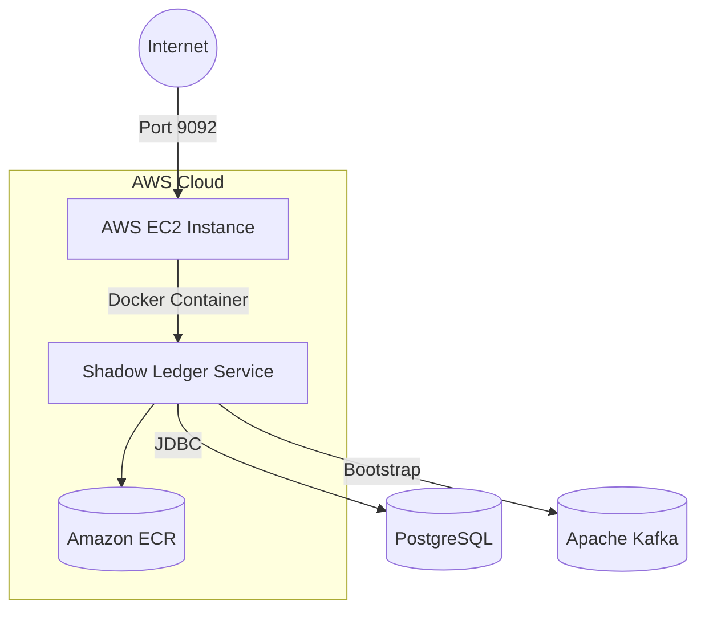

# 🚀 AWS Deployment Guide: Shadow Ledger System

This document provides a comprehensive walkthrough for deploying the **Shadow Ledger Service** to Amazon Web Services (AWS) using EC2 and ECR.

## 🏗 System Architecture

The deployment follows a containerized approach, hosting the Spring Boot application on an EC2 instance while interfacing with data streams and persistence layers.



# 📋 Prerequisites
AWS CLI configured with AdministratorAccess.
Docker installed and running locally.
Java 17+ and Maven (bundled via ./mvnw).
Access to a PostgreSQL instance and Kafka broker (Self-hosted or Managed).

### 🛠 Step-By-Step Deployment
1. Artifact Preparation & Containerization

First, we package the application and build a production-grade Docker image.


```mermaid
# Navigate to service directory
cd shadow-ledger-service

# Compile and package the Spring Boot JAR
./mvnw clean package -DskipTests

# Build the Docker image
docker build -t shadow-ledger-service:latest .
```

### 2. Infrastructure Setup (ECR)
Create a private repository to host your container images.

```mermaid

# Set Variables
AWS_REGION="us-east-1"
AWS_ACCOUNT_ID=$(aws sts get-caller-identity --query Account --output text)
REPO_NAME="shadow-ledger-service"

# Create ECR Repository
aws ecr create-repository --repository-name $REPO_NAME --region $AWS_REGION

# Authenticate Docker to ECR
aws ecr get-login-password --region $AWS_REGION | \
  docker login --username AWS --password-stdin $AWS_ACCOUNT_ID.dkr.ecr.$AWS_REGION.amazonaws.com

# Tag and Push
docker tag $REPO_NAME:latest $AWS_ACCOUNT_ID.dkr.ecr.$AWS_REGION.amazonaws.com/$REPO_NAME:latest
docker push $AWS_ACCOUNT_ID.dkr.ecr.$AWS_REGION.amazonaws.com/$REPO_NAME:latest
```

### 3. Provisioning the EC2 Instance
   We use Amazon Linux 2023 for optimized performance and security.

   Security Group Configuration:

   Protocol Port	Source	Description
   TCP	22	Your IP	SSH Access
   TCP	9092	0.0.0.0/0	Application API
   
```mermaid
# Create Security Group
SG_ID=$(aws ec2 create-security-group \
  --group-name shadow-ledger-sg \
  --description "Security group for Ledger Service" \
  --query 'GroupId' --output text)

# Authorize Ingress
aws ec2 authorize-security-group-ingress --group-id $SG_ID --protocol tcp --port 22 --cidr $(curl -s https://checkip.amazonaws.com)/32
aws ec2 authorize-security-group-ingress --group-id $SG_ID --protocol tcp --port 9092 --cidr 0.0.0.0/0
```

### 4. Instance Initialization & Deployment
Once the EC2 is running, connect via SSH to pull and run the container.

```mermaid
# Connect to Instance
ssh -i "your-key.pem" ec2-user@your-ec2-ip

# Install & Enable Docker
sudo yum update -y
sudo yum install docker -y
sudo systemctl start docker
sudo usermod -a -G docker ec2-user
newgrp docker # Apply group changes without logout

# Authenticate & Pull Image
aws ecr get-login-password --region us-east-1 | docker login --username AWS --password-stdin [ACCOUNT_ID].dkr.ecr.us-east-1.amazonaws.com

# Run Service
docker run -d \
  --name shadow-ledger-service \
  -p 9092:9092 \
  -e SPRING_DATASOURCE_URL=jdbc:postgresql://[DB_HOST]:5432/ledger_db \
  -e SPRING_DATASOURCE_USERNAME=[USER] \
  -e SPRING_DATASOURCE_PASSWORD=[PASS] \
  -e SPRING_KAFKA_BOOTSTRAP_SERVERS=[KAFKA_HOST]:9092 \
  [ACCOUNT_ID].dkr.ecr.us-east-1.amazonaws.com/shadow-ledger-service:latest
```


### 🧪 Verification & Monitoring
Health Check:

```mermaid
curl http://[EC2_PUBLIC_IP]:9092/actuator/health

docker logs -f shadow-ledger-service
```

#### 🔐 Security Best Practices Implemented
Least Privilege: Security groups restricted to specific IPs for SSH.

Environment Isolation: Application runs inside a Docker container.

Credential Management: No secrets are stored in the codebase; all sensitive data is passed via environment variables.
#### 💰 Cost Estimation (Monthly)

Service	Usage	Cost (Free Tier)	Cost (Standard)

EC2 t3.micro	750 hours	$0	~$7.50
ECR Storage	< 500MB	$0	~$0.10
Data Transfer	< 100GB	$0	$0.09/GB

# ⚖️ Event Ordering & Deterministic Ledger Logic

### Overview

In a distributed financial system, events can arrive at the consumer out of chronological order due to network latency or Kafka partition rebalancing. The Shadow Ledger Service implements a strict deterministic ordering engine to ensure balance integrity.

## 🧠 Ordering Strategy
To achieve a "Single Version of Truth," we apply a two-tier sorting mechanism.
1. Primary Sort: Temporal (timestamp)
   We rely on the event's creation timestamp (in milliseconds) rather than the processing time. This ensures that the ledger reflects the real-world sequence of transactions.


2. Secondary Sort: Lexicographical (eventId)
   In scenarios where multiple transactions occur within the same millisecond (high-throughput), we use the eventId as a deterministic tie-breaker. This prevents "flapping" balances where the order could change between database reads.


## 💻 Implementation Details
   Deterministic Calculation (SQL)

   The balance is calculated on-the-fly using PostgreSQL Window Functions. This approach guarantees that even if events were inserted into the database "out of order," they are summed in the "correct" order.
```mermaid
SELECT 
    account_id,
    type,
    amount,
    -- Calculate a running balance based on strict order
    SUM(CASE WHEN type='CREDIT' THEN amount ELSE -amount END) 
        OVER (
            PARTITION BY account_id 
            ORDER BY timestamp ASC, event_id ASC
        ) AS running_balance,
    event_id
FROM ledger_events
WHERE account_id = :accountId
ORDER BY timestamp ASC, event_id ASC;
```
### Idempotency & Deduplication
   To handle Kafka's "at-least-once" delivery guarantee, we implement a Unique Constraint on the event_id.

```mermaid
@Transactional
public void processEvent(LedgerEventDTO dto) {
    // 1. Check if event exists (Idempotency)
    if (repository.existsByEventId(dto.eventId())) {
        log.warn("Duplicate event detected: {}. Skipping.", dto.eventId());
        return;
    }
    
    // 2. Insert event (Natural ordering is handled during Read)
    repository.save(new LedgerEvent(dto));
}
```

   2. Insert event (Natural ordering is handled during Read)
   repository.save(new LedgerEvent(dto));
   }

## 🔄 Visual Example: Out-of-Order Recovery
   Sequence	Event	Timestamp	Amount	Action	Balance (Calc)

   1 (Arrived 1st)	E102	10:00:05	+100	Wait/Sort	150 (Final)
   2 (Arrived 2nd)	E101	10:00:02	+50	Wait/Sort	50 (Initial)

   Resulting Ledger View:
   E101 (t: 02) -> Balance: 50
   E102 (t: 05) -> Balance: 150
   # 🛡️ Guarantees
   Strong Consistency: Re-running the event log will always yield the exact same balance.
   Auditability: Every balance change is linked to a specific, immutable event ID.
   Resilience: The system can recover from partition offsets or database restores without losing state logic.
   # 🚀 Future Enhancements
   Snapshots: For accounts with >10,000 events, implement a "Snapshot" table to store the balance every 1,000 events to optimize query performance.
   Strict Sequence Validation: Adding a sequence_number per account to detect gaps in the event stream.

